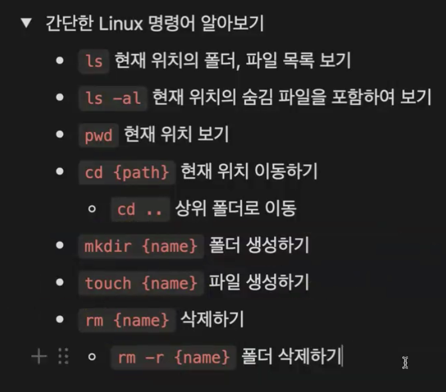

# Linux 명령어 알아보기 

맥북: 터미널 윈도우 : git Bash 에서 한다.
- ls : 현재 위치에서 어떤 폴더가 있는지 확인하고 싶다면 ls하면된다
- ls -al : ls랑 비슷하지만 숨심 파일을 보고 싶다면 ls -al하면된다
- Pwd : 지금 현재 위치 보기
- cd {path} : {} 안에 내가 가고 싶은곳 적으면 된다 예: cd desktop
- cd .. : 현재위치에서 하나 위로 올라가고 싶다면.
- mkdir {name} : 폴더 생성
- touch {name} : 파일 생성
- rm {name} : 파일 삭제
- rm -r {name} : 폴더 삭제  

이 밖에 더 많은 명령어 들이 있다.  

---
# 📘 TIL - Git 기본기

## 📦 Repository란?

**Repository(레포지토리)**는 말 그대로 ‘저장소’를 의미한다.  
Git에서는 버전 관리를 수행하는 공간을 Repository라고 부른다.

Repository에는 두 가지 종류가 있다:

- **로컬 레포지토리(Local Repository)**: 내 컴퓨터 안에서 관리되는 저장소  
- **리모트 레포지토리(Remote Repository)**: GitHub 등 서버에 존재하는 저장소

즉, **Repository는 특정 디렉토리(폴더)를 버전 관리하는 저장소**라고 이해하면 된다.

## 🧠 Git이 동작하는 방식

Git은 항상 **특정 폴더(디렉토리)를 기준**으로 동작한다.  
어떤 폴더에서 `git init`을 실행하면, 그 폴더를 기준으로 **하위에 있는 모든 파일과 폴더가 Git으로 버전 관리**된다.

> ✅ **상위 폴더에는 영향을 주지 않는다!**

## 🚨 주의할 점

예를 들어, **바탕화면(Desktop)** 에서 실수로 `git init`을 실행하면,  
바탕화면 전체가 Git으로 버전 관리되는 상태가 된다 😱  
이럴 경우 `.git` 폴더를 찾아서 삭제해야 한다.

> 📌 Git은 항상 **작업할 폴더 내부**에서 초기화해야 한다!  
> 꼭 필요한 폴더를 만들고 그 안에서 `git init`을 실행하자.

## ✅ 정리

- Repository는 버전 관리를 위한 **저장소**
- 로컬과 리모트, 두 가지 종류가 있다
- Git은 **폴더 단위로 동작**하며, 해당 폴더 내부만 관리
- 바탕화면이나 전체 디렉토리에 `git init` 하지 않도록 주의!

---
# 📘 `git init`

## 🧠 git init 이란?

`git init`은 **현재 폴더를 Git으로 버전 관리하겠다**는 선언을 하는 명령어다.  
이 명령어를 실행하면 해당 폴더에 **`.git` 폴더가 생성**되며,  
Git이 버전 관리를 위해 필요한 모든 정보가 이 안에 저장된다.

## ⚙️ 사용 방법

~~~bash
mkdir my-folder       # 새 폴더 만들기
cd my-folder          # 폴더로 이동
git init              # Git 레포지토리 초기화
~~~

- 실행하면 (main) 또는 (master) 브랜치 이름이 터미널에 나타남
- .git 폴더가 생기며, 이 폴더는 숨겨져 있음

👉 숨김 파일 확인하려면:  ls -al  

📁 .git 폴더는?
- Git이 커밋, 브랜치, 설정, 로그 등 모든 기록을 저장하는 공간
- 사용자가 직접 수정하거나 삭제할 필요 없음 (오히려 위험함)
- 그냥 놔두면 됨

❗️주의할 점
- .git 폴더가 이미 있는 폴더에서는 git init을 다시 할 필요 없음
- (main) 또는 (master)가 보인다면, 이미 Git으로 관리 중인 상태  

✅ 요약
git init을 하면 .git이라는 디렉토리가 생성되고,
이 안에 Git이 버전 관리를 위해 필요한 모든 데이터가 저장된다.
우리가 할 일은? 그냥 init 한 번 해주고, .git은 건들지 않기!

---
