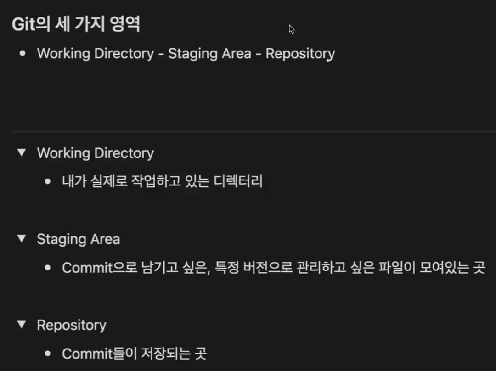

# 복습  
🧠 Git 기본 개념 정리
📍 Git과 GitHub의 차이

Git : 버전 관리 도구 (프로그램 자체)
→ 내 컴퓨터에서 파일의 변경 이력을 추적하고 관리함.

GitHub : Git 저장소를 인터넷 상에서 관리할 수 있는 서비스
→ 다른 사람과 협업하거나, 백업용으로 원격 저장 가능.  

⚙️ git init
“현재 폴더를 Git으로 버전 관리하겠다!” 라는 선언 명령어

- 실행 시, 현재 폴더 안에 .git 폴더가 자동으로 생성됨
- .git 폴더 안에는 Git이 버전 관리를 위해 필요한 모든 정보가 들어있음
- ⚠️ .git 폴더 안으로 직접 들어가서 조작할 필요 ❌
- .git 폴더는 숨김 폴더라서 보이진 않지만,
  ls -al 명령어로 확인 가능

💻 사용 예시  
1. 터미널 열기
cd Desktop
2. 새로운 폴더 만들기
mkdir git-class
3. 해당 폴더로 이동
cd git-class
4. Git 저장소 초기화
git init
5. 숨김파일 보기
ls -al
→ .git 폴더가 생성되어 있으면, 성공적으로 Git이 초기화된 것 ✅  

---
#### 🧱 Git Commit 개념 정리
📍 Commit이란?
- commit 이란 “현재 변경 사항을 하나의 버전으로 저장한다”는 뜻이다.
- 쉽게 말해 → “지금 상태를 저장해둬!” 라는 명령이다.
- 여러 번의 commit을 쌓아가면서 버전 관리(history 관리) 가 이루어진다.
#### ⚙️ Commit은 세 가지 영역을 기반으로 동작한다
    
Git은 내부적으로 아래 3가지 영역(Area) 을 중심으로 작동한다.

#### 1️⃣ Working Directory (작업 디렉토리)
- 실제 내가 작업하고 있는 현재 폴더
- git init을 통해 .git이 생성된 폴더를 의미
- 파일을 생성하거나 수정하는 모든 일이 여기서 이루어진다.
- 아직 git add를 하지 않았다면, Git이 추적하지 않는(Untracked) 상태다.  

#### 2️⃣ Staging Area (스테이징 영역)
- “커밋할 준비가 된 파일”들이 잠시 올라와 있는 임시 공간
- git add 명령어로 파일을 이곳에 올린다.
- 여러 파일을 수정했다면, commit 전에 어떤 파일을 버전에 포함시킬지 선택할 수 있다.
- 즉, “이 파일들을 이번 커밋에 담을게요” 하는 단계다.  
#### 3️⃣ Repository (저장소)
- git commit 명령어를 실행하면,
Staging Area의 파일들이 하나의 commit(버전) 으로 저장된다.
- 이 commit들이 쌓이는 곳이 바로 Repository(저장소) 이다.
- 종류:
- Local Repository : 내 컴퓨터 안의 .git 폴더 (로컬 저장소)
- Remote Repository : GitHub 등 외부 서버에 있는 저장소

---
#### 🔄 세 영역의 관계 요약
**명령어 배우기:**  
Working Directory  →  (git add)  →  Staging Area  →  (git commit)  →  Repository

| 단계                | 설명                 | 명령어          |
| ----------------- | ------------------ | ------------ |
| Working Directory | 실제 작업하는 폴더         | 파일 수정 / 생성   |
| Staging Area      | 커밋할 파일을 올려두는 임시 공간 | `git add`    |
| Repository        | 커밋들이 저장되는 버전 저장소   | `git commit` |

#### 💡 핵심 요약
- git add → “이 파일들을 커밋할 준비를 할게”
- git commit → “지금 상태를 하나의 버전으로 기록할게”
- 커밋을 쌓아가며 프로젝트의 이력 관리와 버전 복원이 가능하다 ✅

---
#### 🧠 Git 버전관리의 실제 시작점
📍 git init의 진짜 의미

git init을 했다고 해서 모든 파일의 버전 관리가 자동으로 시작되는 것은 아니다.
이 명령어는 단지 “이 폴더를 Git으로 관리하겠다” 라는 선언일 뿐이다.

- 실행 결과: .git 폴더가 생성됨
- .git 폴더 안에는 Git이 버전 관리를 위해 필요한 내부 설정과 정보가 저장됨
- 하지만 아직 아무 파일도 버전 관리 대상이 아님
- 즉, Git에게 “이 폴더를 관리해줘” 라고 말했을 뿐이고,
“이 파일을 관리해줘” 라고는 말하지 않은 상태다.  

#### 📂 버전 관리의 진짜 시작: git add + git commit
Git은 git add와 git commit을 통해서만 실제 버전 관리를 시작한다.
즉, 아래 과정을 거쳐야 Git이 파일의 변경 이력을 추적한다.
1. git add
→ “이 파일을 버전 관리하겠다” 라고 Git에게 알려주는 명령어
→ Staging Area(임시 저장공간)에 파일을 올림
2. git commit
→ “이 시점의 파일 상태를 기록하겠다” 라는 명령어
→ Repository(저장소)에 버전으로 저장  

#### 🔄 Git 파일 상태 흐름  
| 상태                   | 설명                                 | 명령어          |
| -------------------- | ---------------------------------- | ------------ |
| **Untracked**        | Git이 아직 추적하지 않는 새 파일               | (처음 생성된 파일)  |
| **Staged (Tracked)** | `git add`를 통해 Staging Area에 올라간 상태 | `git add`    |
| **Committed**        | `git commit`으로 Repository에 기록된 상태  | `git commit` |
| **Modified**         | 이미 추적 중인 파일이 수정된 상태                | (파일 수정 시)    |

#### 📌 상태 변화 요약  
Untracked → (git add) → Staged → (git commit) → Committed
Committed → (파일 수정) → Modified → (git add) → Staged → (git commit)
- git add : 변경된 내용을 Staging Area에 올림
- git commit : 변경 내용을 Repository에 기록
- 커밋 후 다시 Working Directory(작업 공간)로 돌아오지만,
- 이때는 Git이 해당 파일을 추적하고 있기 때문에 Tracked 상태로 유지된다.  
#### 💡 정리 포인트  
- git init → “이 폴더를 관리할게!”
- git add → “이 파일을 관리할게!”
- git commit → “이 시점의 파일 상태를 기록할게!”

15:40부터 시작